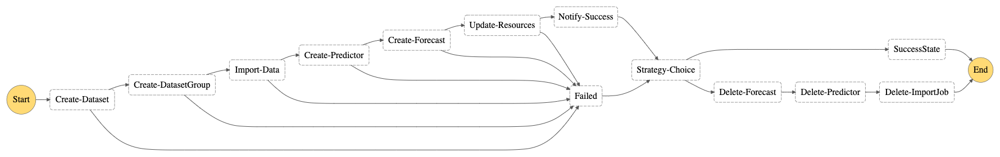

# Forecast Visualization Automation Blogpost

This package contains the source code with a StepFunctions pipeline that is able to perform
multiple actions within Amazon Forecast, including the following actions:
- Dataset creation
- Dataset import
- Predictor creation
- Forecast generation
- Data transformation 

Once the steps are completed, the solution notifies the users of its completion and delete 
all unnecessary resources on Amazon Forecast. The aim of this solution is to provide a way 
to easily get new forecasts once new data comes available. The solution is deployed using 
[AWS SAM](https://aws.amazon.com/serverless/sam/) therefore it requires minimum effort to 
deploy and use.

## Architecture





## Deployment and Usage

First, clone this repository to your machine and install SAM CLI.

With the SAM CLI installed, run the following command inside this repository folder 
to deploy the pipeline:
```
sam build && sam deploy --guided
```

Once built and deployed, the solution will create 2 buckets:
- __Forecast Bucket__: Where your training and infereces are stored.
- __Athena Bucket__: Where the raw Athena queries are stored.

The name of each bucket can be found on the output section of the cloudformation stack on
the console. To see it access the Cloudformation tab on the console. If you did not change 
the command line, the stack name will be __x__.

The step function starts upon new files are dropped within the ```s3://ForecastBucket/train/```
folder. When the steps are completed, the S3 Bucket will have the following structure:
```
/params.json    # Your parameters file.
/train/         # Where the training csv files are stored
/history/       # Where the previous forecasts are stored
/history/raw/   # Contains the raw Amazon Forecast exported files
/history/clean/ # Contains the previous processed Amazon Forecast exported files
/quicksight/    # Contains the most upated forecasts according to the train dataset
/tmp/           # Where the Amazon Forecast files are temporarily stored before processing
```

When querying on Quicksight, we use the ```/train``` and ```/quicksight``` folders as input
to Athena.

You should also receive an email subscription confirmation by AWS SNS. Confirm it in order
to get notifications from the step functions.

## Configuration & Settings

To start using the solution, make sure to properly setup the [configuration file](params_test.json).
It contains all the necessary configuration according to your dataset and desire and it is uploaded
to the __Forecast Bucket__ as soon as you deploy the solution. You can also change the configuration by
uploading a new file version to the bucket. The file [params.json](params.json) provides an
example on some of the supported configurations for each section.

### Dataset Settings

The dataset settings are related to the training data for the system. You can check all the
supported dataset types on this [link]. Please note that __the order of the Schema attributes
has to match the order provided on the csv files__.

You should also specify a domain for your datasets. [This link](https://docs.aws.amazon.com/forecast/latest/dg/howitworks-domains-ds-types.html) provides you with the necessary fields for each domain.


### Predictor settings

Amazon Forecast demands you to choose between picking one desired algorithm to perform
the training or performing AutoML. If you want to specify a model you can do so by adding the
```AlgorithmArn``` field on the Forecast entity. See the following table for a list of the
supported algorithms __*__, followed by their respective ARN:


| Algorithm     | ARN                                       |
| ------------- | ----------------------------------------- |
| ARIMA         | arn:aws:forecast:::algorithm/ARIMA        |
| DeepAR        | arn:aws:forecast:::algorithm/Deep_AR_Plus |
| ETS           | arn:aws:forecast:::algorithm/ETS          |
| NTPS          | arn:aws:forecast:::algorithm/NPTS         |
| Prophet       | arn:aws:forecast:::algorithm/Prophet      |

__* The supported algorithm list might increase over time. Visit the [Amazon Forecast Reference Guide](https://docs.aws.amazon.com/forecast/latest/dg/aws-forecast-choosing-recipes.html) in order the get the most updated information.__ 

In addition to that, the basic configuration demands that you soecify the Forecast Horizon and the
Forecast Frequency.

### Forecast Settings

As soon as your Amazon Forecast finishes the training, we need to specify the quantiles of which
to export. This can be done by using the ```ForecastTypes``` field, under ```Forecast```. It
must be comprised of a list of the desired quantiles. Supported types include '0.01', '0.5', '0.99'.
Every Forecast type specified at this step will be shown on the transformed dataset using the 
```type``` field.

Due to the Amazon Forecast system, all strings provided on the Datasets are transformed to lower. We
also add the last observations of the time series for each identifier to the forecasted dataset, in order
to provide better visualization.

## Visualization

To perform visualizations on the forecasted data we recommend using Athena to query the tables
already created by the StepFunctions workflow. You can merge the tables __train__ and __forecast__
using basic SQL queries and get a unified view over your training and forecasted dataset. Further
instructions on how to visualize using Amazon QuickSight will be provided by the attached [AWS Blogpost]().

`
SELECT LOWER(quicksight.item_id) as item_id,
         quicksight.target_value,
         quicksight.timestamp,
         quicksight.type
FROM forecast_blog.quicksight
UNION ALL
SELECT LOWER(training.item_id) as item_id,
         training.target_value,
         training.timestamp,
         'history' as type
FROM forecast_blog.training
`